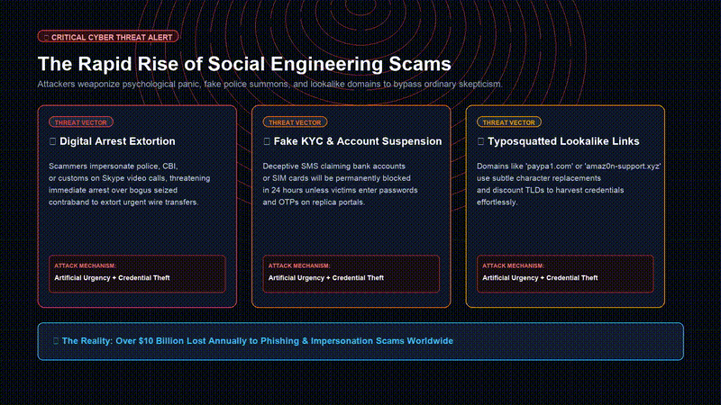
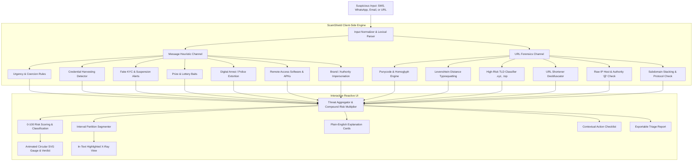
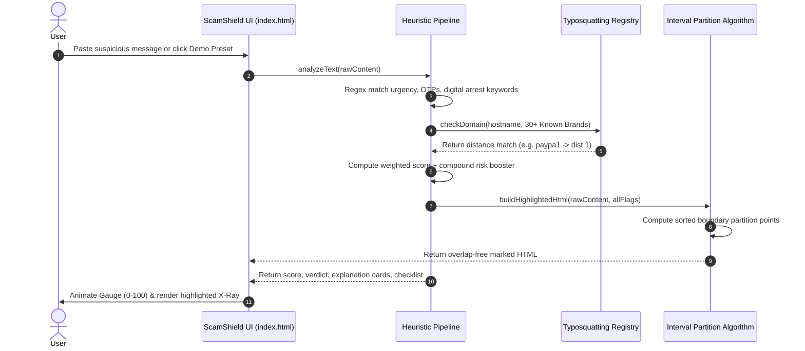

# ScamShield 🛡️
> **Real-Time Client-Side Phishing, Scam & Extortion Intelligence Engine**  
> *Built for Cybersecurity Hackathon 2026 — Theme: Phishing/Scam Detection & Online Safety*

[](https://github.com/Anurag-M1/ScamShield/releases/tag/v1.0.0)
[](#-privacy--zero-telemetry-guarantee)
[-06b6d4.svg)](#-architecture--technology-stack)
[](https://vercel.com/new/clone?repository-url=https://github.com/Anurag-M1/ScamShield)
[](https://github.com/Anurag-M1/ScamShield)

---

## 🎬 Video Showcase & Demo Presentation

Watch the official 70-second video demo walkthrough with synchronized voiceover narration showcasing live phishing triage, in-text red flag segmentation, and typosquatting detection:

https://github.com/user-attachments/assets/scamshield-demo-pitch

> 🎥 **Direct Video File**: [`scamshield_demo_pitch.mp4`](scamshield_demo_pitch.mp4) (1080p HD, 3.2 MB)  
> 🌐 **Interactive Web Player**: Launch [`pitch_deck.html`](pitch_deck.html) in any web browser.

<p align="center">
  
</p>

---

## 📌 Executive Summary

Modern cybercriminals exploit psychological urgency, fear of law enforcement, and visually deceptive links to drain bank accounts and steal digital identities. Most users lack specialized cybersecurity training to spot subtle domain typosquats or recognize social engineering tricks.

**ScamShield** bridges this gap as an instant, zero-dependency, client-side triage engine. Users simply paste a suspicious SMS, WhatsApp message, email excerpt, or URL. In under 5 milliseconds, ScamShield returns:
1. **Dynamic Risk Score (0–100)** with an animated SVG cyber gauge and verdict (**Safe**, **Suspicious**, or **Likely Scam**).
2. **In-Text Annotated X-Ray View**: Red flags are highlighted directly inside the original text without layout breakage using an interval-partitioning algorithm.
3. **Plain-English Explanations**: Details *why* each indicator is dangerous and the exact manipulation tactic being deployed.
4. **Actionable Checklist**: Dynamic next steps (e.g., immediate bank card freezing instructions, AnyDesk uninstallation steps, reporting hotlines).
5. **One-Click Triage Report**: Generates a structured markdown report ready for sharing with family, IT helpdesks, or police authorities.

---

## 🏗️ System Architecture & Detection Flow

ScamShield is engineered with a multi-layered heuristic pipeline that analyzes both linguistic patterns and URL domain structures in parallel.

### 1. High-Level Flow Diagram



### 2. Detection & Segmentation Sequence



---

## ⚡ 6 Built-In One-Click Demo Scenarios

ScamShield includes 6 pre-configured test scenarios to demonstrate immediate detection across diverse threat vectors:

| Preset Scenario | Vector Tested | Triggered Signals | Score | Verdict |
| :--- | :--- | :--- | :---: | :---: |
| 🏦 **Fake Bank KYC** | Banking Phishing | Urgency (24h), NetBanking password, OTP solicit, `.xyz` domain, HDFC spoofing | **100 / 100** | 🚨 **Likely Scam** |
| 📦 **Courier Fee Hold** | Parcel Delivery Scam | USPS impersonation, $1.99 fee bait, 12h deadline, `bit.ly` shortened link | **100 / 100** | 🚨 **Likely Scam** |
| 🎁 **Mega Lottery Win** | Advance-Fee Fraud | $1.5M Coca-Cola prize, requests ATM PIN & bank details, WhatsApp urgency | **93 / 100** | 🚨 **Likely Scam** |
| 🚨 **Digital Arrest Threat** | Extortion / Cyber Coercion | Narcotics Bureau threat, digital arrest warrant, AnyDesk install command | **100 / 100** | 🚨 **Likely Scam** |
| 🪪 **Typosquatted Login** | Credential Harvesting | Lookalike domain (`paypa1-security.top`), Levenshtein distance 1, `.top` TLD | **100 / 100** | 🚨 **Likely Scam** |
| ☕ **Safe Message** | Benign Communication | Normal conversational text, no coercion, no financial lures, no links | **0 / 100** | ✅ **Safe / Neutral** |

---

## 🔬 Deep-Dive: Detection Capabilities

### 1. Social Engineering & Message Signals
- **Coercive Urgency**: Catches artificial time pressures (`"within 24 hours"`, `"account blocked immediately"`, `"final notice"`, `"expires today"`).
- **Credential & Financial Harvesting**: Immediate critical alerts for OTP, ATM PIN, CVV, passwords, card numbers, Aadhaar, or SSN.
- **Fake Compliance & KYC Notices**: Flags fake account freeze warnings, KYC renewal traps, tax rebate phishing, and power disconnection threats.
- **Prize & Lottery Baits**: Detects unsolicited lottery wins, crypto airdrops, and "task/job" scams.
- **Digital Arrest Extortion**: Flags fake police warrants, narcotics interception claims, and Skype video interrogation demands.
- **Remote Access Exploitation**: Flags prompts to install `AnyDesk`, `TeamViewer`, `QuickSupport`, or download Android `.apk` packages.

### 2. URL Forensics & Typosquatting Engine
- **Levenshtein Distance Analysis**: Compares domain tokens against 30+ high-profile brands (PayPal, Apple, Amazon, HDFC, SBI, Chase, Netflix, etc.). Flags single-letter edits and character swaps (e.g. `1 -> l`, `0 -> o`, `vv -> w`).
- **High-Abuse TLDs**: Detects discount top-level domains statistically saturated with phishing (`.xyz`, `.top`, `.click`, `.zip`, `.cam`, `.sbs`, etc.).
- **URL Obfuscation**: Identifies URL shorteners (`bit.ly`, `tinyurl.com`, `t.co`) masking destination hosts.
- **Homoglyph / Punycode (IDN Spoofing)**: Detects internationalized character sets (Cyrillic `а` vs Latin `a`) designed to visually deceive victims.
- **Raw IP Addresses & Deceptive Authority**: Detects numerical IP hosts and the `@` sign authority deception trick (`http://bank.com@evil.com`).

---

## 🔒 Privacy & Zero-Telemetry Guarantee

- **100% Client-Side Execution**: ScamShield evaluates all heuristics inside the local JavaScript runtime.
- **Zero Network Transmission**: Not a single byte of message content or link metadata is sent to any external server or API.
- **Offline / Air-Gapped Ready**: Operates seamlessly offline via the `file://` protocol.
- **Zero Third-Party CDNs**: All styles, icons, and logic are fully self-contained in a single file.

---

## 🚀 Deployment & Installation

### Option 1: Deploy to Vercel (Instant 1-Click)
ScamShield is pre-configured with `vercel.json` for immediate zero-config deployment:
```bash
# Using Vercel CLI
cd /path/to/ScamShield
npx vercel
```
Or connect this GitHub repository directly to [Vercel](https://vercel.com) for automatic CI/CD deployment on every push.

### Option 2: Deploy to GitHub Pages
1. Go to repository **Settings** > **Pages**.
2. Under **Build and deployment**, select **Deploy from a branch**.
3. Choose branch `main` and folder `/ (root)`.
4. Click **Save** — your app is live!

### Option 3: Netlify Drop
Drag and drop the repository folder directly onto [app.netlify.com/drop](https://app.netlify.com/drop).

### Option 4: Local Double-Click Execution
Double-click [`index.html`](index.html) in Finder or File Explorer. No Node.js or local web server required.

---

## 🔮 Future Roadmap

1. **On-Device Quantized ML Classifier**: Integrate a quantized ONNX / WebAssembly transformer model (MobileBERT fine-tuned on phishing corpora) for nuanced contextual semantic analysis.
2. **Browser Extension**: Real-time background scanning for webmail (Gmail, Outlook), social media, and web browsing.
3. **WhatsApp / Telegram Triage Bot**: Allow users to forward suspicious messages directly to a messaging bot for instant threat reports.
4. **QR Code Optical Scanner**: In-browser camera decoding to inspect embedded phishing URLs inside physical letters and utility bills.

---

## 🏷️ Repository Tags & Topics
`cybersecurity` • `phishing-detection` • `scam-detector` • `hackathon` • `online-safety` • `vanilla-js` • `client-side` • `levenshtein-distance` • `anti-phishing` • `zero-dependencies` • `social-engineering-defense`

---

## 📝 License
MIT License © 2026 Anurag M & ScamShield Contributors. Open source for hackathon presentation, security education, and digital safety awareness.
